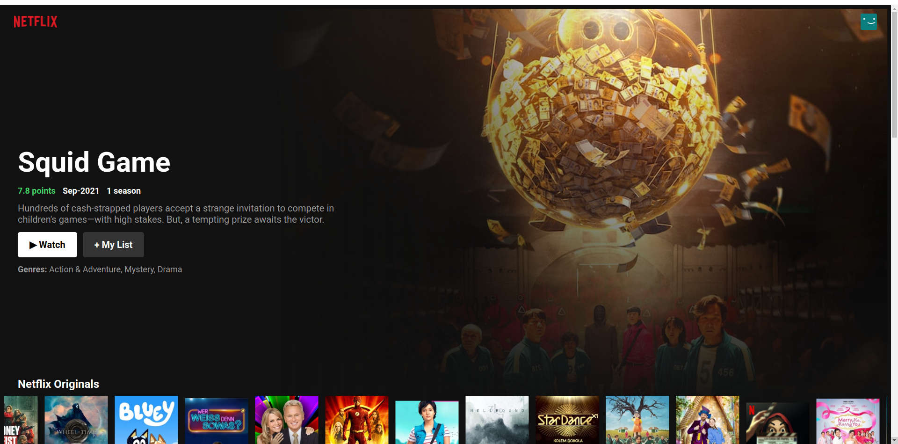
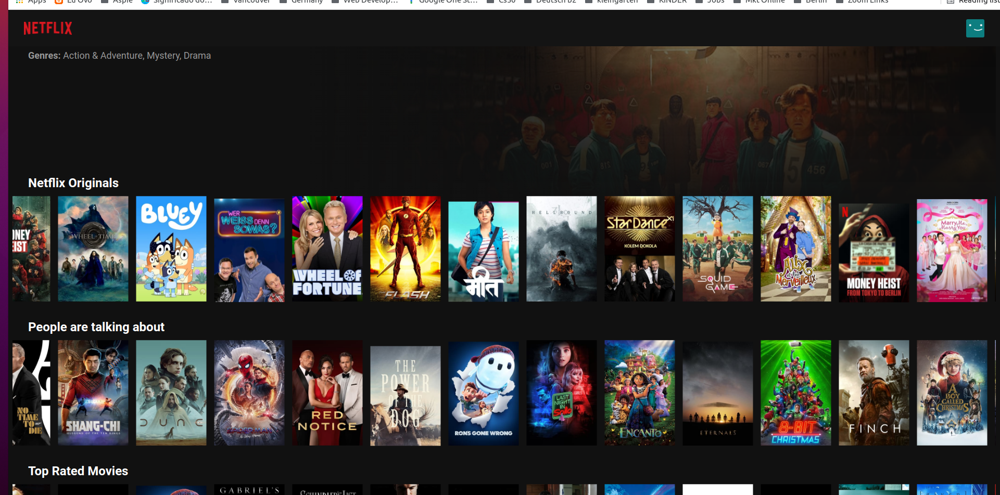

# Netflix - Clone

This is a project exercise did during my web development course. The data source used was from TMDB API.

## API Reference

const API_BASE = "https://api.themoviedb.org/3";

## Screenshots






## Getting Started

To get a local copy up and running follow these simple steps.

### Prerequisites

Make sure you have npm and Node.js installed on your machine.

### Installation

1. Clone the repo

```sh
git clone https://github.com/born3am/netflix-clone.git
```

2. Install NPM packages

```sh
npm install
```

3. Run the development server

```sh
npm run dev
```

## Usage

1. Browser will open automatically on http://localhost:5173.
2. Fresh movies and series data will be fetched from TMDB API and displayed on the screen.

## Deployment Instructions

To deploy the project to GitHub Pages, follow these steps:

1.  Ensure you have built the project by running:

```sh
npm run build
```

2.  Deploy the built project to GitHub Pages by running:

```sh
npm run deploy
```

## Linting Instructions

To run both Prettier and ESLint fixes together, run:

```sh
npm run fix
```
